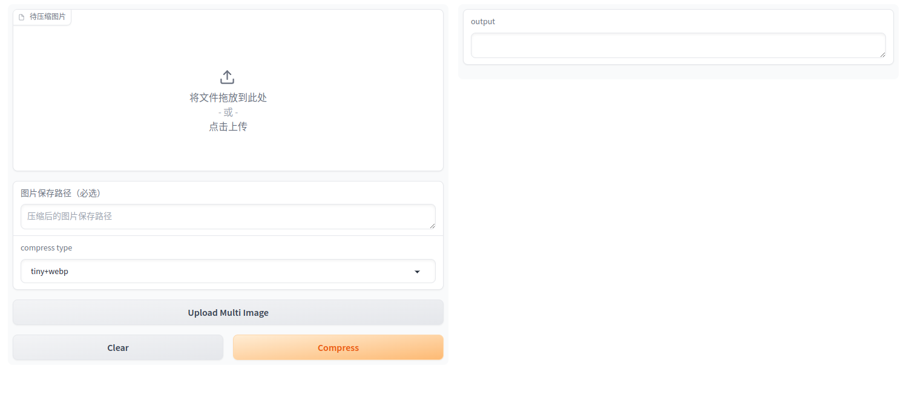

# tiny_gradio

一个使用 **tinify API** 和 **Gradio** 实现的图片压缩工具，tinify API就是著名图片压缩工具 **tinypng** 提供的API

支持单张图片和多张图片

支持 **tinify** 压缩 和 **tinify+webp** 压缩两种模式




## 快速开始
1、申请 tinify API Key，每月有500次免费请求， 申请地址: https://tinify.com/dashboard/api

2、在项目根目录创建 .env 文件，输入 TINIFY_API_KEY=<你的API Key>

3、创建 venv 依赖环境
```shell
# 如果是Linux
pip install -r requirements.txt

# 如果是Mac
pip install -r requirements_mac.txt

```

4、最后执行 main.py
```shell
python main.py
```


**最后非常感谢 tinypng 提供的API！**